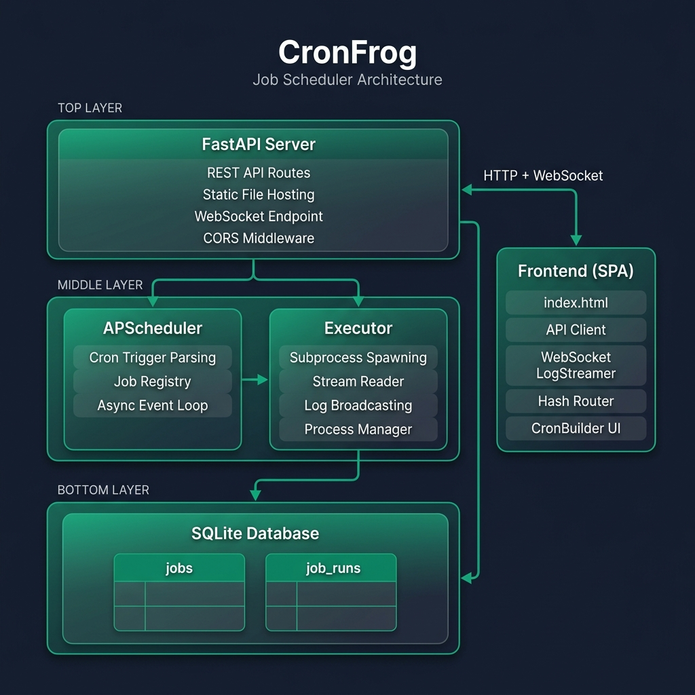
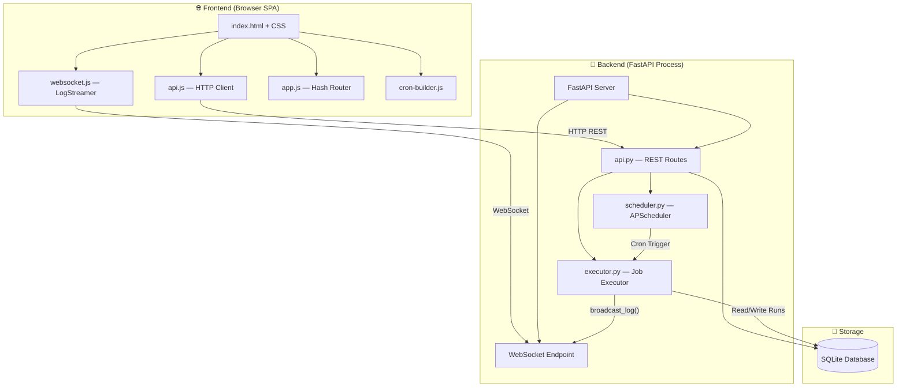
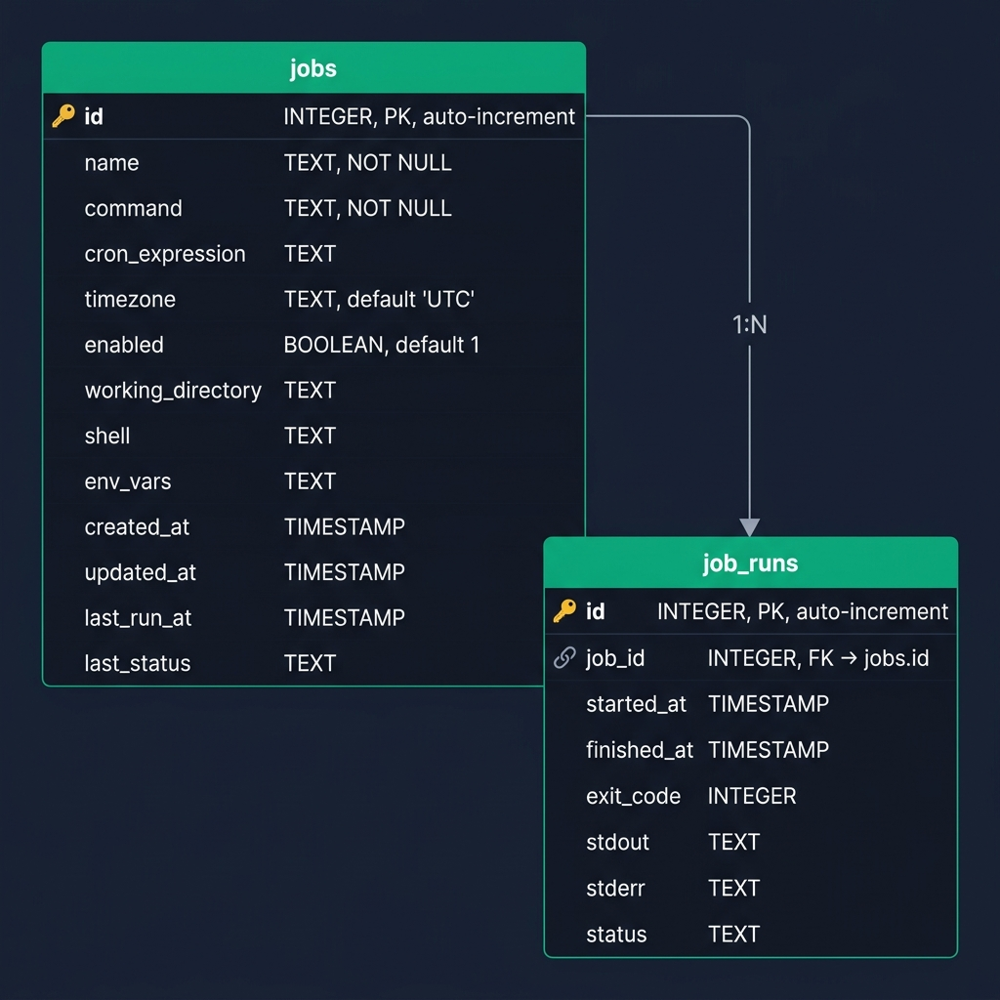
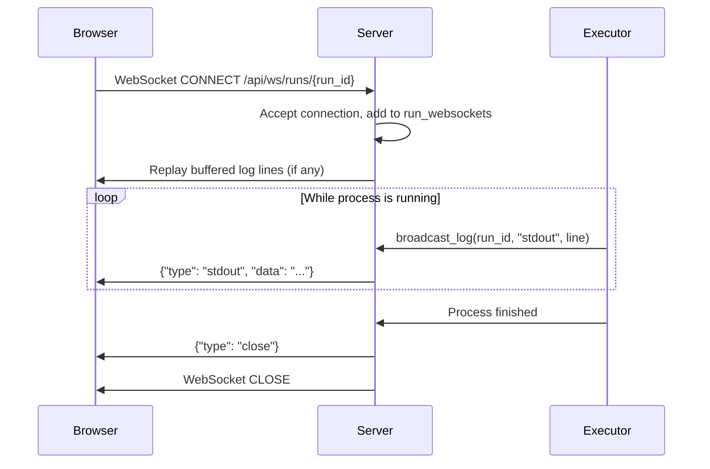
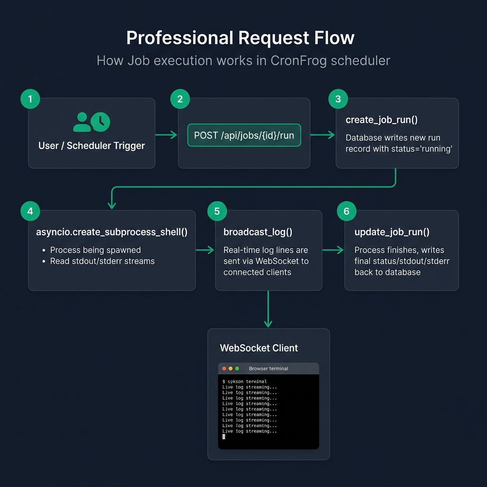

<div align="center">


# CronFrog — Technical Documentation

**A lightweight, self-hosted job scheduling application with a real-time web UI**

[](LICENSE)
[](https://python.org)
[](https://fastapi.tiangolo.com)

</div>

---

## Table of Contents

1. [Overview](#1-overview)
2. [Architecture](#2-architecture)
3. [Project Structure](#3-project-structure)
4. [Backend Deep Dive](#4-backend-deep-dive)
   - 4.1 [Entry Point — `run.py`](#41-entry-point--runpy)
   - 4.2 [Application Bootstrap — `server/main.py`](#42-application-bootstrap--servermainpy)
   - 4.3 [REST API — `server/api.py`](#43-rest-api--serverapipy)
   - 4.4 [Database Layer — `server/database.py`](#44-database-layer--serverdatabasepy)
   - 4.5 [Scheduler — `server/scheduler.py`](#45-scheduler--serverschedulerpy)
   - 4.6 [Executor — `server/executor.py`](#46-executor--serverexecutorpy)
5. [Database Schema](#5-database-schema)
6. [API Reference](#6-api-reference)
7. [WebSocket Protocol](#7-websocket-protocol)
8. [Frontend Deep Dive](#8-frontend-deep-dive)
   - 8.1 [HTML Structure — `index.html`](#81-html-structure--indexhtml)
   - 8.2 [API Client — `js/api.js`](#82-api-client--jsapijs)
   - 8.3 [Application Router — `js/app.js`](#83-application-router--jsappjs)
   - 8.4 [UI Components — `js/components.js`](#84-ui-components--jscomponentsjs)
   - 8.5 [Cron Expression Builder — `js/cron-builder.js`](#85-cron-expression-builder--jscron-builderjs)
   - 8.6 [Live Log Streamer — `js/websocket.js`](#86-live-log-streamer--jswebsocketjs)
   - 8.7 [Styling & Design System — `css/style.css`](#87-styling--design-system--cssstylecss)
9. [Job Execution Flow](#9-job-execution-flow)
10. [Configuration & Environment](#10-configuration--environment)
11. [Dependencies](#11-dependencies)
12. [License](#12-license)

---

## 1. Overview

CronFrog is a **self-contained job scheduling platform** that combines a Python backend (FastAPI + APScheduler) with a modern single-page web interface. It allows users to:

- **Create scheduled jobs** using standard cron expressions
- **Execute shell commands** or scripts on the host machine
- **Monitor job runs** with real-time log streaming via WebSockets
- **Manage jobs** through a REST API or the built-in web dashboard

The entire application runs as a single process — no external message brokers, no Redis, no Celery. Just Python, SQLite, and a browser.

### Key Design Decisions

| Decision | Rationale |
|---|---|
| **SQLite** for persistence | Zero-configuration, serverless, perfect for single-node deployments |
| **APScheduler (AsyncIO)** | In-process scheduler that shares the same event loop as FastAPI |
| **WebSockets** for live logs | Eliminates polling; real-time stdout/stderr streaming to the browser |
| **Static SPA** (no build step) | Vanilla JS frontend served directly by FastAPI — no npm, no bundler |
| **`asyncio.create_subprocess_shell()`** | Non-blocking subprocess execution within the async event loop |

---

## 2. Architecture

CronFrog follows a **monolithic, single-process architecture** where all components — the HTTP server, the background scheduler, and the job executor — run within the same Python process and share a common `asyncio` event loop.

### High-Level Architecture Diagram



### Component Interactions



### How the Three Engines Cooperate

| Engine | Role | Lifecycle |
|---|---|---|
| **FastAPI** | HTTP server + WebSocket host | Starts with `uvicorn.run()`, serves API and static files |
| **APScheduler** | Background cron engine | Started in `lifespan()` context, polls cron triggers on the event loop |
| **Executor** | Subprocess manager | Invoked by APScheduler or the API; spawns `asyncio` subprocesses |

All three share the **same `asyncio` event loop**, meaning:
- The scheduler can call `execute_job()` without thread synchronization.
- The executor can broadcast logs to WebSocket clients without leaving the event loop.
- The API can fire-and-forget a job via `asyncio.create_task()`.

---

## 3. Project Structure

```
cronfrog/
├── run.py                      # Application entry point
├── requirements.txt            # Python dependencies
├── LICENSE                     # MIT License
├── README.md                   # Project README
│
├── server/                     # Backend Python package
│   ├── __init__.py             # Package marker
│   ├── main.py                 # FastAPI app creation, lifespan, WebSocket, static mount
│   ├── api.py                  # REST API route definitions (APIRouter)
│   ├── database.py             # SQLite data access layer (DAL)
│   ├── scheduler.py            # APScheduler configuration and job management
│   └── executor.py             # Async subprocess execution + log broadcasting
│
├── public/                     # Frontend static SPA (served by FastAPI)
│   ├── index.html              # Single-page HTML with all views
│   ├── css/
│   │   └── style.css           # Complete CSS with glassmorphism design system
│   ├── js/
│   │   ├── api.js              # Fetch-based HTTP API client
│   │   ├── app.js              # Application controller + hash-based router
│   │   ├── components.js       # HTML template renderers for stats, tables, badges
│   │   ├── cron-builder.js     # Interactive cron expression builder widget
│   │   └── websocket.js        # WebSocket client for real-time log streaming
│   └── static/
│       └── cronfrog_logo.png   # Application logo (favicon + sidebar)
│
├── data/
│   └── cronfrog.db             # SQLite database file (development copy)
│
└── docs/
    ├── cronfrog_logo.png       # Logo for documentation
    └── steps/                  # Step-by-step UI screenshots
        ├── step_1.png
        ├── step_2.png
        ├── step_3.png
        ├── step_4.png
        └── step_5.png
```

---

## 4. Backend Deep Dive

### 4.1 Entry Point — `run.py`

**File:** [`run.py`](run.py)

The entry point is deliberately minimal. Its only responsibilities are:

1. Ensure the project root is on `sys.path` so the `server` package can be imported.
2. Import the FastAPI `app` instance from `server.main`.
3. Start the Uvicorn ASGI server on the configured port.

```python
import os, sys

sys.path.insert(0, os.path.dirname(os.path.abspath(__file__)))

from server.main import app

if __name__ == "__main__":
    import uvicorn
    port = int(os.environ.get("PORT", 8000))
    uvicorn.run(app, port=port)
```

**Port Configuration:** Reads the `PORT` environment variable, defaulting to `8000`.

---

### 4.2 Application Bootstrap — `server/main.py`

**File:** [`server/main.py`](server/main.py)

This is the heart of the application. It orchestrates all components:

#### Lifespan Management

```python
@asynccontextmanager
async def lifespan(app: FastAPI):
    init_db()                     # 1. Create tables if they don't exist
    scheduler.start()             # 2. Start the APScheduler event loop
    load_jobs_into_scheduler()    # 3. Re-register all enabled jobs from DB
    yield                         # 4. Application is running
    scheduler.shutdown()          # 5. Graceful shutdown
```

FastAPI's `lifespan` context manager replaces the deprecated `on_startup`/`on_shutdown` events. It ensures:
- The database schema exists before any request is served.
- All previously enabled jobs resume their schedules on restart.
- The scheduler shuts down cleanly when the process exits.

#### CORS Middleware

```python
app.add_middleware(
    CORSMiddleware,
    allow_origins=["*"],      # Allows all origins (suitable for local/dev use)
    allow_credentials=True,
    allow_methods=["*"],
    allow_headers=["*"],
)
```

#### WebSocket Endpoint

```python
@app.websocket("/api/ws/runs/{run_id}")
async def websocket_endpoint(websocket: WebSocket, run_id: int):
```

This endpoint:
1. **Accepts** the WebSocket connection.
2. **Replays** any buffered log lines (for clients joining mid-execution).
3. **Keeps the connection open** until the client disconnects.
4. **Cleans up** the connection from the `run_websockets` registry on disconnect.

#### Static File Mounting

```python
app.mount("/", StaticFiles(directory=public_dir, html=True), name="public")
```

The `public/` directory is mounted at the root path with `html=True`, which enables:
- Serving `index.html` for the root URL `/`
- Automatic resolution of CSS, JS, and static asset paths

> **Important:** This mount is placed **after** the API router, so `/api/*` routes take priority over static file resolution.

---

### 4.3 REST API — `server/api.py`

**File:** [`server/api.py`](server/api.py)

All API endpoints are grouped under an `APIRouter` with the prefix `/api`. The module imports from both the database layer and the scheduler/executor modules.

#### Route Summary

| Method | Endpoint | Handler | Description |
|---|---|---|---|
| `GET` | `/api/jobs` | `api_get_jobs()` | List all jobs with next run times |
| `POST` | `/api/jobs` | `api_create_job()` | Create a new job |
| `GET` | `/api/jobs/{job_id}` | `api_get_job()` | Get a single job by ID |
| `PUT` | `/api/jobs/{job_id}` | `api_update_job()` | Update a job's configuration |
| `DELETE` | `/api/jobs/{job_id}` | `api_delete_job()` | Delete a job and unschedule it |
| `POST` | `/api/jobs/{job_id}/start` | `api_start_job()` | Enable a job and add to scheduler |
| `POST` | `/api/jobs/{job_id}/stop` | `api_stop_job()` | Disable a job and remove from scheduler |
| `POST` | `/api/jobs/{job_id}/run` | `api_run_job()` | Manually trigger an immediate execution |
| `POST` | `/api/jobs/{job_id}/runs/{run_id}/kill` | `api_kill_job_run()` | Terminate a running process |
| `GET` | `/api/jobs/{job_id}/runs` | `api_get_job_runs()` | List execution history for a job |
| `GET` | `/api/jobs/{job_id}/runs/{run_id}` | `api_get_job_run()` | Get details of a specific run |
| `GET` | `/api/stats` | `api_get_stats()` | Dashboard statistics |

#### Key Behavior Patterns

**Job Creation:** When a job is created with `enabled=True`, it's immediately registered with APScheduler:
```python
@router.post("/jobs")
def api_create_job(job_data: Dict[Any, Any]):
    job = create_job(job_data)
    if job.get('enabled'):
        schedule_job(job)
    return job
```

**Job Update:** Updating a job re-registers (or removes) it from the scheduler based on the `enabled` flag:
```python
if job.get('enabled'):
    schedule_job(job)   # Re-register with new cron expression
else:
    unschedule_job(job_id)  # Remove from scheduler
```

**Manual Run:** Uses `asyncio.create_task()` for fire-and-forget execution:
```python
@router.post("/jobs/{job_id}/run")
async def api_run_job(job_id: int):
    asyncio.create_task(execute_job(job_id))
    return {"status": "started"}
```

---

### 4.4 Database Layer — `server/database.py`

**File:** [`server/database.py`](server/database.py)

This module implements a thin **Data Access Layer (DAL)** over SQLite using Python's built-in `sqlite3` module. It follows a simple functional pattern where each function opens a connection, performs the operation, and closes it.

#### Database Location Strategy

```python
if os.environ.get('CRONFROG_DB_PATH'):
    DB_PATH = os.environ.get('CRONFROG_DB_PATH')
else:
    home = str(Path.home())
    DB_PATH = os.path.join(home, '.cronfrog', 'data', 'cronfrog.db')
```

| Source | Path | Use Case |
|---|---|---|
| Default | `~/.cronfrog/data/cronfrog.db` | Prevents Uvicorn `--reload` from restarting on DB changes |
| Environment | `CRONFROG_DB_PATH` | Custom deployment or containerized environments |

#### Connection Factory

```python
def get_db():
    os.makedirs(os.path.dirname(DB_PATH), exist_ok=True)
    conn = sqlite3.connect(DB_PATH, check_same_thread=False)
    conn.row_factory = sqlite3.Row    # Enables dict-like row access
    return conn
```

- `check_same_thread=False` allows connections to be used across async callbacks (safe because SQLite operations are fast and sequential).
- `sqlite3.Row` as `row_factory` enables column-name access on result rows.

#### Function Catalog

| Function | Purpose |
|---|---|
| `init_db()` | Creates `jobs` and `job_runs` tables if they don't exist |
| `get_all_jobs()` | Fetches all jobs ordered by ID descending |
| `get_job(job_id)` | Fetches a single job by primary key |
| `create_job(job_data)` | Inserts a new job record |
| `update_job(job_id, job_data)` | Updates all mutable fields of a job |
| `delete_job(job_id)` | Hard-deletes a job record |
| `update_job_status(job_id, ...)` | Updates `last_run_at` and `last_status` on a job |
| `create_job_run(job_id, status)` | Inserts a new run record with `status='running'` |
| `update_job_run(run_id, ...)` | Finalizes a run with exit code, stdout, stderr |
| `get_job_runs(job_id, limit)` | Lists recent runs for a job (default limit: 50) |
| `get_job_run(run_id)` | Fetches a single run by ID |
| `get_stats()` | Aggregates counts for total jobs, active jobs, failed runs |

---

### 4.5 Scheduler — `server/scheduler.py`

**File:** [`server/scheduler.py`](server/scheduler.py)

The scheduler module wraps APScheduler's `AsyncIOScheduler` and provides a clean interface for registering and removing cron-triggered jobs.

#### Scheduler Instance

```python
scheduler = AsyncIOScheduler()
```

A single global instance that runs on the FastAPI event loop. It's started during `lifespan()` and shut down on application exit.

#### Scheduling a Job

```python
def schedule_job(job):
    if not job.get('enabled') or not job.get('cron_expression'):
        return

    job_id = str(job['id'])

    if scheduler.get_job(job_id):
        scheduler.remove_job(job_id)    # Remove existing to re-register

    trigger = CronTrigger.from_crontab(job['cron_expression'])
    scheduler.add_job(
        execute_job,            # The async function to call
        trigger=trigger,        # Parsed cron trigger
        args=[job['id']],       # Pass the job ID
        id=job_id,              # Use string ID for APScheduler
        name=job['name']        # Human-readable name
    )
```

**Key Design:** `CronTrigger.from_crontab()` converts standard 5-field cron expressions (`minute hour day month weekday`) into APScheduler trigger objects.

#### Boot-Time Recovery

```python
def load_jobs_into_scheduler():
    jobs = get_all_jobs()
    for job in jobs:
        if job.get('enabled'):
            schedule_job(job)
```

On startup, all enabled jobs in the database are re-registered with the scheduler. This ensures jobs survive server restarts.

#### Scheduler Status

```python
def get_scheduler_status():
    jobs_status = {}
    for job in scheduler.get_jobs():
        if job.next_run_time:
            utc_time = job.next_run_time.astimezone(datetime.timezone.utc)
            jobs_status[int(job.id)] = utc_time.strftime('%Y-%m-%d %H:%M:%S')
        else:
            jobs_status[int(job.id)] = None
    return jobs_status
```

Returns a mapping of `{job_id: next_run_time_utc}` used to display "Next Run" in the dashboard.

---

### 4.6 Executor — `server/executor.py`

**File:** [`server/executor.py`](server/executor.py)

The executor is the most complex module. It manages asynchronous subprocess execution, real-time log broadcasting, and process lifecycle management.

#### In-Memory Registries

```python
active_processes = {}   # {run_id: asyncio.Process} — for kill support
active_logs = {}        # {run_id: [log_entries]} — buffer for late-joining WS clients
run_websockets = {}     # {run_id: [WebSocket]} — connected log viewers
```

These dictionaries serve as lightweight in-memory state for active executions.

#### Job Execution Lifecycle

The `execute_job()` function implements the complete lifecycle:

```
┌──────────────┐     ┌──────────────┐     ┌───────────────────┐     ┌────────────┐
│ Create Run   │────▶│ Spawn Process│────▶│ Stream stdout/err │────▶│ Finalize   │
│ (DB record)  │     │ (subprocess) │     │ (broadcast logs)  │     │ (DB update)│
└──────────────┘     └──────────────┘     └───────────────────┘     └────────────┘
```

**Step-by-step:**

1. **Create a run record** in the database with `status='running'`.
2. **Prepare the environment**: Copy `os.environ`, merge any job-specific `env_vars` (parsed from JSON).
3. **Resolve the shell**: Use the job's configured shell, or default to `cmd.exe` (Windows) / `/bin/sh` (Unix).
4. **Spawn the subprocess** with `asyncio.create_subprocess_shell()`.
5. **Read stdout and stderr concurrently** using `asyncio.gather()` on two `read_stream()` coroutines.
6. **Broadcast each line** to connected WebSocket clients via `broadcast_log()`.
7. **Wait for process completion** and determine success/failure from the exit code.
8. **Finalize**: Write the complete stdout/stderr and exit code to the database. Clean up in-memory registries. Close WebSocket connections with a `{"type": "close"}` message.

#### Log Broadcasting

```python
async def broadcast_log(run_id, log_type, data):
    # 1. Buffer the log line (for late-joining clients)
    if run_id in active_logs:
        active_logs[run_id].append({"type": log_type, "data": data})
    # 2. Send to all connected WebSocket clients
    if run_id in run_websockets:
        message = json.dumps({"type": log_type, "data": data})
        for ws in run_websockets[run_id]:
            try:
                await ws.send_text(message)
            except:
                pass
```

#### Process Termination

```python
async def kill_job_run(run_id):
    if run_id in active_processes:
        process = active_processes[run_id]
        process.terminate()
        await broadcast_log(run_id, 'stderr', '\n[Process Terminated by User]\n')
        return True
    return False
```

Sends a `SIGTERM` (Unix) or `TerminateProcess` (Windows) signal to the running subprocess.

---

## 5. Database Schema



### `jobs` Table

Stores the configuration for each scheduled job.

| Column | Type | Constraints | Description |
|---|---|---|---|
| `id` | `INTEGER` | `PRIMARY KEY AUTOINCREMENT` | Unique job identifier |
| `name` | `TEXT` | `NOT NULL` | Human-readable job name |
| `command` | `TEXT` | `NOT NULL` | Shell command to execute |
| `cron_expression` | `TEXT` | — | Standard 5-field cron expression |
| `timezone` | `TEXT` | `DEFAULT 'UTC'` | Timezone for cron evaluation |
| `enabled` | `BOOLEAN` | `DEFAULT 1` | Whether the job is active in the scheduler |
| `working_directory` | `TEXT` | — | CWD for the subprocess |
| `shell` | `TEXT` | — | Shell executable (e.g., `/bin/bash`, `powershell.exe`) |
| `env_vars` | `TEXT` | — | JSON string of environment variables |
| `created_at` | `TIMESTAMP` | `DEFAULT CURRENT_TIMESTAMP` | Record creation time |
| `updated_at` | `TIMESTAMP` | `DEFAULT CURRENT_TIMESTAMP` | Last modification time |
| `last_run_at` | `TIMESTAMP` | — | Timestamp of the most recent execution |
| `last_status` | `TEXT` | — | Status of the most recent execution |

### `job_runs` Table

Stores the execution history for each job.

| Column | Type | Constraints | Description |
|---|---|---|---|
| `id` | `INTEGER` | `PRIMARY KEY AUTOINCREMENT` | Unique run identifier |
| `job_id` | `INTEGER` | `FOREIGN KEY → jobs(id)` | Parent job reference |
| `started_at` | `TIMESTAMP` | `DEFAULT CURRENT_TIMESTAMP` | Execution start time |
| `finished_at` | `TIMESTAMP` | — | Execution end time |
| `exit_code` | `INTEGER` | — | Process exit code (`0` = success) |
| `stdout` | `TEXT` | — | Captured standard output |
| `stderr` | `TEXT` | — | Captured standard error |
| `status` | `TEXT` | — | `running`, `success`, or `failed` |

### Relationship

```
jobs (1) ──────< job_runs (N)
      jobs.id ← job_runs.job_id
```

Each job can have **many** run records. Runs are ordered by `id DESC` and limited to 50 per query.

---

## 6. API Reference

All endpoints are prefixed with `/api`. The FastAPI-generated Swagger UI is available at `/docs` when the server is running.

### Jobs CRUD

#### `GET /api/jobs`
Returns all jobs with their next scheduled run time.

**Response:** `200 OK`
```json
[
  {
    "id": 1,
    "name": "Database Backup",
    "command": "./backup.sh",
    "cron_expression": "0 2 * * *",
    "timezone": "UTC",
    "enabled": true,
    "working_directory": "/app/scripts",
    "shell": null,
    "env_vars": null,
    "created_at": "2026-06-30 10:00:00",
    "updated_at": "2026-06-30 10:00:00",
    "last_run_at": "2026-06-30 02:00:00",
    "last_status": "success",
    "next_run_time": "2026-07-01 02:00:00"
  }
]
```

#### `POST /api/jobs`
Creates a new job. Automatically schedules it if `enabled` is `true`.

**Request Body:**
```json
{
  "name": "Health Check",
  "command": "curl -f http://localhost/health",
  "cron_expression": "*/5 * * * *",
  "enabled": true,
  "working_directory": null,
  "shell": null,
  "env_vars": null
}
```

#### `GET /api/jobs/{job_id}`
Returns a single job by ID. Returns `404` if not found.

#### `PUT /api/jobs/{job_id}`
Updates a job. Re-schedules or unschedules based on the `enabled` flag.

#### `DELETE /api/jobs/{job_id}`
Deletes a job and removes it from the scheduler.

### Job Control

#### `POST /api/jobs/{job_id}/start`
Enables a job and adds it to the scheduler.

#### `POST /api/jobs/{job_id}/stop`
Disables a job and removes it from the scheduler.

#### `POST /api/jobs/{job_id}/run`
Triggers an immediate execution. Returns `{"status": "started"}` immediately (fire-and-forget).

#### `POST /api/jobs/{job_id}/runs/{run_id}/kill`
Terminates a running process. Returns `404` if the run is not active.

### Runs & Stats

#### `GET /api/jobs/{job_id}/runs`
Returns the last 50 runs for a job, ordered by most recent first.

#### `GET /api/jobs/{job_id}/runs/{run_id}`
Returns details of a specific run, including `stdout` and `stderr`.

#### `GET /api/stats`
Returns aggregate dashboard statistics.

**Response:**
```json
{
  "total_jobs": 5,
  "active_jobs": 3,
  "failed_runs": 1
}
```

---

## 7. WebSocket Protocol

### Connection

```
ws://localhost:8000/api/ws/runs/{run_id}
```

### Message Format

All messages are JSON-encoded strings.

#### Server → Client Messages

| Message Type | Description | Example |
|---|---|---|
| `stdout` | A line of standard output | `{"type": "stdout", "data": "Backup complete\n"}` |
| `stderr` | A line of standard error | `{"type": "stderr", "data": "Warning: disk space low\n"}` |
| `close` | Server is closing the stream | `{"type": "close"}` |

#### Client → Server

The client does not send meaningful data. The WebSocket is kept alive by the `receive_text()` loop on the server side. When the client disconnects, the server cleans up the connection.

### Connection Lifecycle



### Late-Join Buffer

If a WebSocket client connects **after** a job has started running, the server replays all buffered log lines from `active_logs[run_id]` before streaming new lines. This ensures no output is missed.

---

## 8. Frontend Deep Dive

The frontend is a **vanilla JavaScript Single-Page Application (SPA)** with no build step, no framework, and no npm dependencies. It is served directly as static files by FastAPI.

### 8.1 HTML Structure — `index.html`

**File:** [`public/index.html`](public/index.html)

The HTML defines four distinct views, all present in the DOM but toggled via CSS:

| View ID | Purpose | Route |
|---|---|---|
| `dashboard-view` | Statistics + active jobs table | `#dashboard` |
| `jobs-view` | All jobs list with search and actions | `#jobs` |
| `job-edit-view` | Create/edit job form with cron builder | `#job-edit/{id\|new}` |
| `job-detail-view` | Job details + live terminal output | `#job-detail/{id}` |

**Layout:** The app uses a sidebar + main content layout:
- **Sidebar (`<nav>`):** Contains the logo, navigation links (Dashboard, Jobs), and a GitHub link.
- **Main Content (`<main>`):** Contains all four views, with only one visible at a time.

**Script Loading Order:**
```html
<script src="/js/api.js"></script>        <!-- 1. API client (no dependencies) -->
<script src="/js/websocket.js"></script>   <!-- 2. LogStreamer class -->
<script src="/js/components.js"></script>  <!-- 3. HTML template renderers -->
<script src="/js/cron-builder.js"></script><!-- 4. Cron expression builder -->
<script src="/js/app.js"></script>         <!-- 5. Main app (depends on all above) -->
```

---

### 8.2 API Client — `js/api.js`

**File:** [`public/js/api.js`](public/js/api.js)

A simple, reusable HTTP client object that wraps the `fetch` API.

```javascript
const api = {
    baseUrl: '/api',

    async request(endpoint, options = {}) {
        const url = `${this.baseUrl}${endpoint}`;
        const headers = { 'Content-Type': 'application/json', ...options.headers };
        const response = await fetch(url, { ...options, headers });
        const data = await response.json();
        if (!response.ok) throw new Error(data.detail || 'API request failed');
        return data;
    },

    // Convenience methods
    getJobs()          { return this.request('/jobs'); },
    createJob(data)    { return this.request('/jobs', { method: 'POST', body: JSON.stringify(data) }); },
    runJob(id)         { return this.request(`/jobs/${id}/run`, { method: 'POST' }); },
    // ... etc
};
```

**Design:** All methods return Promises. Error handling throws errors with the server's `detail` message, which are caught and displayed by the calling code.

---

### 8.3 Application Router — `js/app.js`

**File:** [`public/js/app.js`](public/js/app.js)

The `app` object is the central controller. It manages:

| Responsibility | Implementation |
|---|---|
| **Routing** | Hash-based router (`window.location.hash`) |
| **View Switching** | CSS class toggling (`.view.active`) |
| **Data Loading** | Async functions that call `api.*` and render with `components.*` |
| **Event Binding** | Form submission, button clicks, search input |

#### Hash Router

```javascript
router: {
    handleRoute() {
        let hash = window.location.hash.slice(1) || 'dashboard';

        if (hash === 'dashboard') { app.loadDashboard(); }
        else if (hash === 'jobs') { app.loadJobs(); }
        else if (hash.startsWith('job-edit/')) { app.loadJobEdit(id); }
        else if (hash.startsWith('job-detail/')) { app.loadJobDetail(id); }

        // Toggle active view and nav highlight
        document.querySelectorAll('.view').forEach(el => el.classList.remove('active'));
        document.getElementById(viewId).classList.add('active');
    }
}
```

#### Route Map

| Hash | View | Data Loader |
|---|---|---|
| `#dashboard` | `dashboard-view` | `loadDashboard()` — fetches stats + active jobs |
| `#jobs` | `jobs-view` | `loadJobs()` — fetches all jobs, applies search filter |
| `#job-edit/new` | `job-edit-view` | `loadJobEdit('new')` — resets form |
| `#job-edit/{id}` | `job-edit-view` | `loadJobEdit(id)` — populates form from API |
| `#job-detail/{id}` | `job-detail-view` | `loadJobDetail(id)` — loads runs, connects WebSocket |

---

### 8.4 UI Components — `js/components.js`

**File:** [`public/js/components.js`](public/js/components.js)

A stateless object that produces HTML strings from data. No DOM manipulation — just template rendering.

| Method | Output |
|---|---|
| `renderStats(stats)` | Three stat cards (Total Jobs, Active Jobs, Failed Runs) |
| `renderActiveJobRow(job)` | A `<tr>` for the dashboard's active jobs table |
| `renderJobTableRow(job)` | A `<tr>` for the jobs list with action buttons |
| `formatLocalTime(utcStr)` | Converts UTC timestamp to local time string |
| `escapeHtml(unsafe)` | XSS protection for user-provided strings |

#### Status Badge Logic

```
enabled=false  →  badge-disabled  ("Disabled")
enabled=true   →  badge-success   ("Active")
  + running    →  badge-warning   ("Running")
  + failed     →  badge-danger    ("Failed")
```

---

### 8.5 Cron Expression Builder — `js/cron-builder.js`

**File:** [`public/js/cron-builder.js`](public/js/cron-builder.js)

An interactive widget that helps users build cron expressions without memorizing the syntax.

#### Modes

| Tab | Input Controls | Generated Expression |
|---|---|---|
| **Custom** | Free-text input | Direct user input |
| **Minutes** | Interval number | `*/N * * * *` |
| **Hourly** | Minute offset | `M * * * *` |
| **Daily** | Hour + Minute | `M H * * *` |
| **Weekly** | Day checkboxes + Time | `M H * * D1,D2,...` |
| **Monthly** | Day of month + Time | `M H D * *` |

All modes update a shared `<input>` field and a preview display. The preview shows `Current expression: * * * * *`.

---

### 8.6 Live Log Streamer — `js/websocket.js`

**File:** [`public/js/websocket.js`](public/js/websocket.js)

The `LogStreamer` class manages WebSocket connections and terminal-style log rendering.

```javascript
class LogStreamer {
    constructor(terminalEl) {
        this.terminalEl = terminalEl;
        this.ws = null;
        this.isAutoScroll = true;
    }

    connect(runId) {
        this.disconnect();
        const protocol = location.protocol === 'https:' ? 'wss:' : 'ws:';
        this.ws = new WebSocket(`${protocol}//${location.host}/api/ws/runs/${runId}`);

        this.ws.onmessage = (event) => {
            const msg = JSON.parse(event.data);
            if (msg.type === 'close') { this.ws.close(); }
            else { this.appendLog(msg.type, msg.data); }
        };
    }

    appendLog(type, text) {
        const span = document.createElement('span');
        span.className = `terminal-line log-${type}`;
        span.textContent = text;
        this.terminalEl.appendChild(span);

        if (this.isAutoScroll) {
            this.terminalEl.scrollTop = this.terminalEl.scrollHeight;
        }
    }
}
```

**Features:**
- **Auto-scroll:** Automatically scrolls to the bottom as new lines arrive, unless the user has scrolled up.
- **Color coding:** `log-stdout` (white), `log-stderr` (red), `log-system` (for connection messages).
- **Protocol detection:** Automatically uses `wss:` for HTTPS origins.

---

### 8.7 Styling & Design System — `css/style.css`

**File:** [`public/css/style.css`](public/css/style.css)

The CSS implements a **dark-mode glassmorphism** design system.

#### Design Tokens (CSS Custom Properties)

```css
:root {
    --bg-color: #0f172a;           /* Deep slate background */
    --text-primary: #f8fafc;       /* Near-white text */
    --text-secondary: #94a3b8;     /* Muted gray text */
    --accent-primary: #10b981;     /* Emerald green (frog theme!) */
    --accent-hover: #059669;       /* Darker emerald on hover */
    --panel-bg: rgba(30, 41, 59, 0.7);  /* Translucent panel */
    --panel-border: rgba(255, 255, 255, 0.1);
    --danger: #ef4444;             /* Red for errors/failures */
    --warning: #f59e0b;            /* Amber for running state */
    --success: #10b981;            /* Green for success */
    --font-main: 'Inter', sans-serif;
    --font-mono: 'Fira Code', monospace;
}
```

#### Glassmorphism Effect

```css
.glass-panel {
    background: var(--panel-bg);
    backdrop-filter: blur(12px);
    -webkit-backdrop-filter: blur(12px);
    border: 1px solid var(--panel-border);
    border-radius: 16px;
    box-shadow: 0 8px 32px 0 rgba(0, 0, 0, 0.3);
}
```

#### Animations

| Animation | Element | Effect |
|---|---|---|
| `bounce` | Logo icon | Frog-like bouncing in the sidebar |
| `fadeIn` | View transitions | Smooth opacity + translateY entrance |
| `pulse` | Terminal status dot | Breathing glow effect |

#### Responsive Design

```css
@media (max-width: 768px) {
    #app { flex-direction: column; }
    .sidebar { width: 100%; border-right: none; }
    .nav-links { flex-direction: row; }
}
```

On mobile, the sidebar collapses to a horizontal top bar.

---

## 9. Job Execution Flow

This diagram shows the complete end-to-end flow from trigger to completion:



### Detailed Step-by-Step

```
1. TRIGGER
   ├── Manual: User clicks "Run Now" → POST /api/jobs/{id}/run
   └── Scheduled: APScheduler fires CronTrigger → execute_job(job_id)

2. PREPARE (executor.py)
   ├── Fetch job config from database
   ├── Create job_run record (status='running')
   ├── Initialize active_logs buffer
   ├── Merge environment variables
   └── Resolve shell executable

3. EXECUTE
   ├── asyncio.create_subprocess_shell(command, ...)
   ├── Register process in active_processes[run_id]
   └── Launch concurrent stream readers:
       ├── read_stream(stdout) → broadcast_log(run_id, 'stdout', line)
       └── read_stream(stderr) → broadcast_log(run_id, 'stderr', line)

4. STREAM (real-time)
   ├── Each line → appended to active_logs[run_id] buffer
   └── Each line → sent via WebSocket to all run_websockets[run_id]

5. COMPLETE
   ├── Process exits → capture return code
   ├── Determine status: exit_code == 0 ? 'success' : 'failed'
   ├── update_job_run() → Write final stdout, stderr, exit_code to DB
   ├── update_job_status() → Update last_run_at, last_status on parent job
   ├── Clean up active_processes, active_logs
   └── Send {"type": "close"} to all WebSocket clients, then close connections
```

---

## 10. Configuration & Environment

CronFrog is configured entirely through **environment variables**. No configuration files are needed.

| Variable | Default | Description |
|---|---|---|
| `PORT` | `8000` | TCP port for the HTTP/WebSocket server |
| `CRONFROG_DB_PATH` | `~/.cronfrog/data/cronfrog.db` | Absolute path to the SQLite database file |

### Examples

**Windows (PowerShell):**
```powershell
$env:PORT = 8080
$env:CRONFROG_DB_PATH = "C:\data\cronfrog.db"
python run.py
```

**Linux / macOS:**
```bash
PORT=8080 CRONFROG_DB_PATH="/data/cronfrog.db" python run.py
```

---

## 11. Dependencies

CronFrog has a minimal dependency footprint. All dependencies are listed in [`requirements.txt`](requirements.txt):

| Package | Purpose |
|---|---|
| **`fastapi`** | ASGI web framework for REST API + WebSocket support |
| **`uvicorn[standard]`** | ASGI server with WebSocket support (via `websockets` extra) |
| **`apscheduler`** | Background job scheduler with cron trigger support |
| **`websockets`** | WebSocket protocol implementation (used by Uvicorn) |

**Python Standard Library** modules used (no install needed):
- `sqlite3` — Database engine
- `asyncio` — Async event loop + subprocess management
- `json` — JSON serialization
- `os`, `sys`, `pathlib` — File system operations
- `datetime` — Timestamp handling
- `contextlib` — Lifespan context manager

---

## 12. License

CronFrog is released under the **MIT License**.

```
MIT License

Copyright (c) 2026 Shayan Saha

Permission is hereby granted, free of charge, to any person obtaining a copy
of this software and associated documentation files (the "Software"), to deal
in the Software without restriction, including without limitation the rights
to use, copy, modify, merge, publish, distribute, sublicense, and/or sell
copies of the Software...
```

See [`LICENSE`](LICENSE) for the full text.

---

<div align="center">

**🐸 CronFrog** — *Schedule it. Run it. Watch it leap.*

Built with ❤️ by [Shayan Saha](https://github.com/shayansaha85)

</div>
