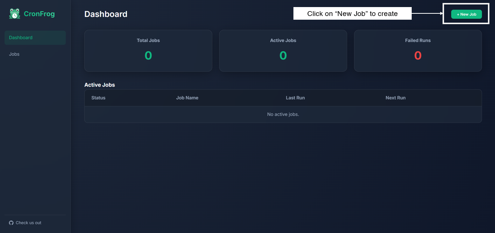
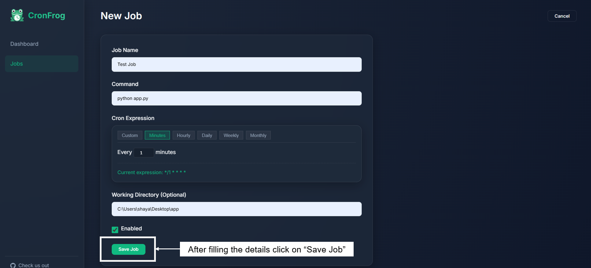
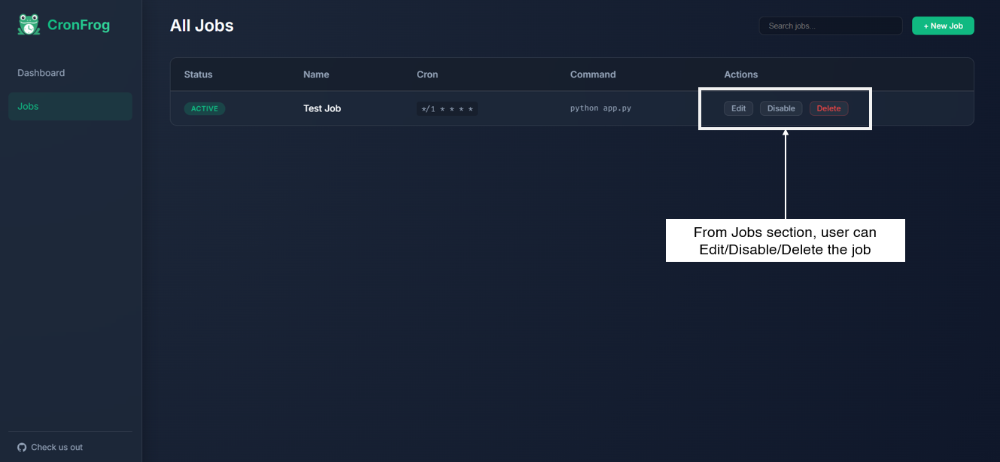
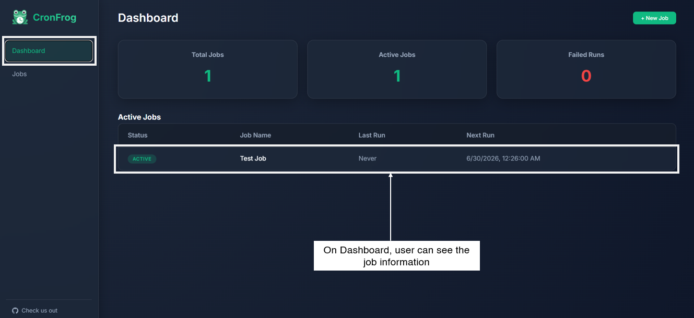
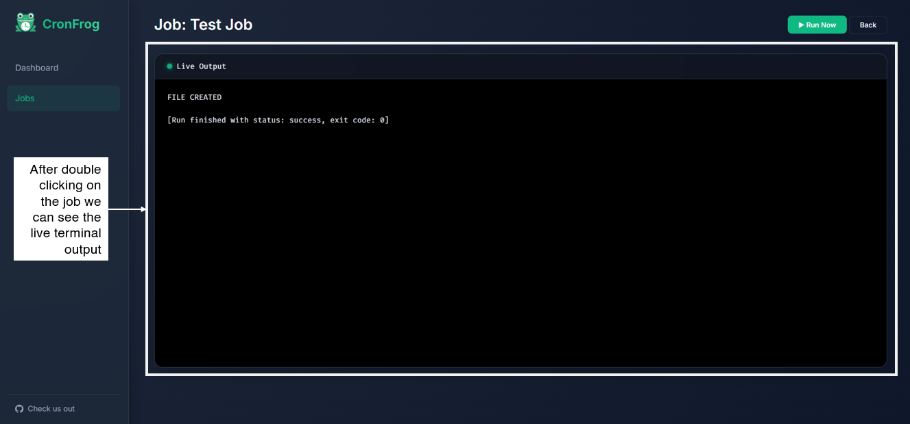

<div align="center">


# CronFrog

</div>
CronFrog is a lightw
eight job scheduling application featuring a backend API and an interactive web interface. It allows you to schedule, monitor, and run shell commands or scripts using cron expressions.

---

## 🚀 Setup Instructions

### 1. Clone the Repository
Clone the source code from GitHub and navigate into the project directory:
```bash
git clone https://github.com/shayansaha85/cronfrog.git
cd cronfrog
```

### 2. Create a Virtual Environment (Recommended)
Isolate the project dependencies from your system Python:
```bash
# Create the virtual environment
python -m venv venv

# Activate (Windows)
venv\Scripts\activate

# Activate (macOS/Linux)
source venv/bin/activate
```

### 3. Install Dependencies
```bash
pip install -r requirements.txt
```

### 4. Run the Application
You can run the application by executing the `run.py` script:
```bash
python run.py
```
By default, the server will start on port **8000** by default

Navigate to the web UI at: **[http://localhost:8000](http://localhost:8000)**

#### Customizing the Port
You can specify a custom port using the `PORT` environment variable:
- **Windows (PowerShell):** `$env:PORT=8080; python run.py`
- **Linux/macOS:** `PORT=8080 python run.py`

---

## 💾 Database Configuration

CronFrog uses **SQLite** as its database engine. 

By default, the database file is stored in your user home directory to prevent server reloads during development when the database updates:
- **Location:** `~/.cronfrog/data/cronfrog.db`

### Overriding the Database Location
If you want to store the database in a custom location (e.g., inside the project folder), set the `CRONFROG_DB_PATH` environment variable before starting the app:
- **Windows:** `$env:CRONFROG_DB_PATH="C:\path\to\my_custom.db"; python run.py`
- **Linux/macOS:** `CRONFROG_DB_PATH="/path/to/my_custom.db" python run.py`

---

## 🛠️ How it Works

CronFrog consists of three main components running concurrently:
1. **FastAPI Server**: Serves the REST API and hosts the static web interface.
2. **APScheduler**: Evaluates cron expressions and triggers jobs in the background.
3. **Executor**: Spawns asynchronous subprocesses to run your shell commands and captures `stdout`/`stderr` logs in real-time.

### Creating & Managing Jobs
- Jobs can be configured with a **Cron Expression** (e.g., `* * * * *` for every minute) and a target command.
- You can specify a custom working directory, shell, and environment variables for each job.
- Jobs can be paused/resumed (enabled/disabled) at any time.

---

## 🩺 Checking if the API is Working

If you want to verify that the backend API is up and running correctly, you can hit the following built-in REST endpoints:

### 1. Stats Endpoint
Returns the overall health and statistics of the scheduler.
**Request:** `GET http://localhost:8000/api/stats`
**Response:**
```json
{
  "total_jobs": 5,
  "active_jobs": 3,
  "failed_runs": 0
}
```

### 2. Jobs List
Returns all configured jobs and their upcoming execution times.
**Request:** `GET http://localhost:8000/api/jobs`

### 3. API Documentation (Swagger UI)
Because CronFrog is built with FastAPI, interactive API documentation is automatically generated. You can explore and test all available endpoints by visiting:
**[http://localhost:8000/docs](http://localhost:8000/docs)**

---

## 🔌 WebSockets (Live Logs)
CronFrog supports real-time log streaming using WebSockets. When a job is actively running, the web interface connects to `/api/ws/runs/{run_id}` to stream the standard output directly to your browser without polling!

---

## 📸 Step-by-Step Visual Guide

Here is a quick walkthrough on how to use the CronFrog web interface:

### Step 1: Dashboard Overview
When you will open the app on https://localhost:8000 or [https://localhost:DEFINED_PORT](https://localhost:DEFINED_PORT), you can see your main dashboard where all your scheduled jobs are listed. Click on New Job to create one.


### Step 2: Create a New Job
Fill all information and click the button to add a new job.


### Step 3: Configure Job Details
Your new job will appear in the list. From here, yawe can manually trigger a run, edit, or delete it.


### Step 4: Check Your Job
User can see the job details on the dashboard.


### Step 5: View Execution Logs
If you double click on the job, it will launch a terminal where user can see the logs.

